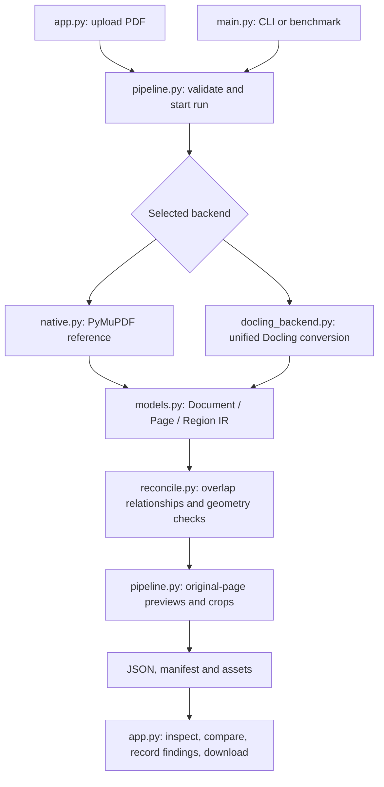

# How the Python pipeline works



## The main entry point

```python
from pathlib import Path
from extraction.pipeline import run_pipeline

run_dir, document, manifest = run_pipeline(
    Path("samples/example.pdf"),
    Path("runs"),
    backend="docling",
    options={"ocr": True},
    progress=print,
)
```

`document` is a plain dictionary ready for JSON serialization or inspection. `run_dir` contains the persisted result. The live model objects are not passed into the viewer.

## Why text, tables and figures stay together

The chosen backend processes the PDF as one document. Text belongs to page regions, tables retain cells, figures retain geometry, and all regions share one coordinate convention.

The native reference assigns words to detected table regions before forming body text. The Docling backend uses the tool's own layout and document structure; it does not run a second independent table detector. Both return the same minimal IR contract.

The reconciliation step flags uncertain interactions instead of automatically dropping content. Text inside a figure is linked through metadata. Caption association and complete semantic figure recovery remain research tasks.

## Where future transformations belong

Once extraction is evaluated, insert reviewed transformations after the IR is created:

```text
Extract -> IR -> detect sensitive spans -> review decisions
        -> translate/redact -> reconstruct -> validate export
```

Do not overwrite `original_text` or source provenance when that phase is introduced. IR 0.1 currently calls source content `text`; evolve the schema deliberately and increment its version when changing this contract.

## Baseline comparison is not fusion

When benchmarking two backends, each produces an independent IR. The app compares runs of the same source hash. It does not silently combine the best-looking regions from different tools. That keeps the baseline reproducible and makes later improvements measurable.
